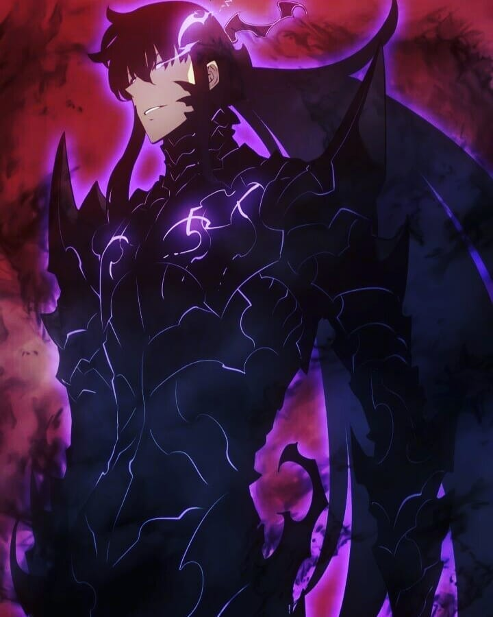

  
## ╭━━━≺👑 𝐗-𝐁𝐎𝐓 👑≻━━━╮
  
## 
  
## ╰━━━≺👑 𝐗-𝐁𝐎𝐓 👑≻━━━╯
  
 

 

## 𝘅𝗯𝗼𝘁 𝗮 𝗺𝘂𝗹𝘁𝗶 𝗳𝘂𝗻𝗰𝘁𝗶𝗼𝗻𝗮𝗹 𝗯𝗼𝘁 𝗳𝗼𝗿 𝘄𝗵𝗮𝘁𝘀𝗮𝗽𝗽 
##

## SCAN QR CODE

## ℂℝ𝔼𝔻𝕀𝕋𝕊
## [𝓜𝓐𝓘𝓝 𝓑𝓐𝓢𝓔 𝓞𝓕 𝓒𝓗𝓔𝓜𝓢-𝓜𝓓4 𝓑𝓨 𝓓𝓖𝓧𝓔𝓞𝓝 ✨](https://github.com/DGXeon/CheemsBot-MD4)

## [2𝓝𝓓 𝓑𝓐𝓢𝓔 𝓞𝓓 𝓜𝓐𝓡𝓘𝓝 𝓑𝓨 𝓝𝓔𝓓𝓤𝓢_𝓐𝓣](https://github.com/NEXUSAT12/MARIN)

## Clone Repo & Installation dependencies
git clone https://github.com/NEXUSAT12/XBOT.git
cd XBOT

npm start
## For Termux/Ssh/Ubuntu
apt update
apt upgrade
pkg update && pkg upgrade
pkg install bash
pkg install libwebp
pkg install git -y
pkg install nodejs -y 
pkg install ffmpeg -y 
pkg install wget
pkg install imagemagick -y
git clone https://github.com/NEXUSAT12/XBOT
cd XBOT
npm start
## For VPS
apt install nodejs 
apt install git 
apt apt install ffmpeg 
apt apt install libwebp 
apt apt install imagrmagick
apt install bash
git clone https://github.com/NEXUSAT12/XBOT
cd XBOT
npm start

## For 24/7 Activation (Termux)
npm i -g pm2 && pm2 start nexus.js && pm2 save && pm2 logs
